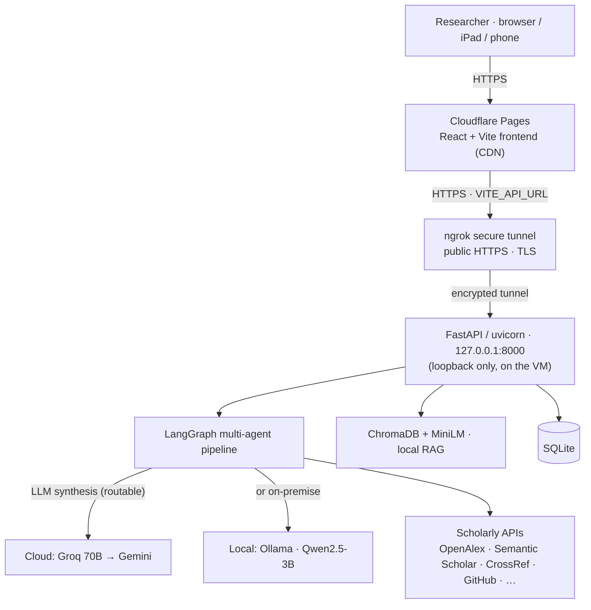

# REFlect AI — Personalised Research Impact Assessment

> Sign in with your **ORCID iD** and REFlect AI conditions the whole analysis on *you*: it profiles the researcher, traces a paper's **downstream influence** — citations, code, patents, policy, funding — through open research data, drafts one evidence-grounded sentence per source for **you to curate**, and composes an auditable, reference-cited impact narrative. Runs on cloud LLMs **or** a fully **on-premise local model** — your choice, per request.

[](https://www.python.org/)
[](https://fastapi.tiangolo.com/)
[](https://react.dev/)
[](https://github.com/langchain-ai/langgraph)
[](https://groq.com/)
[](https://orcid.org/)
[](LICENSE)

**Live:** frontend on Cloudflare Pages → backend on an institutional VM via a secure tunnel. *(Demo link may be offline outside review windows — see [Deployment](#deployment--infrastructure).)*

---

## What it does

REFlect AI is a **personalised, field-aware multi-agent pipeline** that conditions impact analysis on the individual researcher and keeps a human accountable for every claim:

| Step | What happens |
|---|---|
| **1. Profile** | On ORCID sign-in, builds a researcher profile (top works, fields, bibliometrics) from OpenAlex |
| **2. Resolve** | DOI, arXiv ID, or title → canonical metadata across complementary scholarly indices |
| **3. Route** | A field-aware classifier picks which evidence sources to query (core always on + recall fallback) |
| **4. Retrieve** | Parallel agents fetch evidence — citations, code, patents, policy, funding, biomedical/clinical |
| **5. Trace** | Downstream-impact tracer follows the citing literature, elevating works that out-cite or out-fund the source |
| **6. Draft → Curate → Compose** | Drafts one grounded sentence per source; **you keep only what you approve**; composes from those |
| **7. Validate** | A faithfulness judge (0–1) and a four-dimension peer-reviewer score the output |
| **8. Audit** | Every agent step, routing decision, API call, and evidence source is logged in the UI |

---

## Architecture



The backend runs **continuously on an institutional VM** and is reached over public HTTPS through an outbound tunnel — no inbound ports opened. Every LLM call routes through one chokepoint, so the **cloud** engine and the **on-premise** engine are interchangeable per request.

---

## On-premise local model (Cloud ↔ Local toggle)

A per-request **Engine** toggle runs the *entire* synthesis pipeline either on cloud LLMs or on a **small language model hosted on the VM itself** (Ollama · Qwen2.5-3B, 4-bit) — so evidence and generated text can stay entirely on institutional infrastructure. Selected via a header, gated server-side; **default requests stay on the cloud path**.

### Benchmark — on-premise 3B vs cloud


| Metric (n = 18 landmark papers) | Local 3B (on-VM) | Cloud (Groq 70B) |
|---|---|---|
| **Faithfulness** (0–1, cloud-judged) | **0.86 ± 0.08** | **0.86 ± 0.07** |
| Summary latency (warm) | 5.0 ± 0.9 s | 0.6 ± 0.1 s |

Across 18 landmark papers spanning ML, biology, and physics, the **on-premise 3B matches the 70B cloud model on faithfulness** (identical 0.86 means) — at the cost of higher (but still practical) latency. To keep the comparison fair, **both** summaries were scored by the same cloud judge.

**Why it works:** the task is *grounded* (compose from evidence already retrieved), which is exactly where small models are strong — no 70B world-knowledge is needed, only faithful composition. **Trade-off:** the local path is private and $0 but slower (CPU inference) than cloud.

---

## Tech stack

**Backend** — FastAPI · LangGraph (multi-agent state machine) · ChromaDB + sentence-transformers (RAG) · Groq/Gemini + **Ollama** (LLM) · SQLite · PyJWT · ORCID OAuth
**Frontend** — React 18 + TypeScript · Vite · React Router · ORCID sign-in · Lucide
**Infra** — Cloudflare Pages (frontend) · ngrok tunnel · Windows VM (backend, Task Scheduler auto-restart) · $0 hosting

---

## Auth & security

- **ORCID OAuth is the only sign-in** — verified academic identity, which also auto-links the researcher's publications. No passwords stored.
- **Token-gated endpoints** — the expensive LLM endpoints (`/analyze`, `/compose`, `/evaluate`, `/ref/beta`) require a valid token (401 otherwise); public reads (search, stats, profile) stay open.
- Randomised JWT signing secret · per-IP rate limiting · input sanitisation (SQLi/XSS/path-traversal) · CORS restricted to the Pages origin · secrets in `.env`, never shipped to the browser.

---

## Performance (measured, single-user, warm)

| Operation | Cloud | Local 3B (on-VM) |
|---|---|---|
| Liveness (tunnel overhead) | +0.05 s | — |
| Search (cold / cached) | 5.7 s / 0.07 s | — |
| Retrieval + draft (`/analyze`) | ~5.8 s ± 2.4 | — |
| Summary synthesis | ~2 s | ~3 s warm (45 tok/s) |
| Full compose (3 LLM calls) | ~2 s | ~14 s |

Retrieval is I/O-bound (8 agents in parallel → time ≈ slowest API, not the sum). See [Benchmark](#benchmark--on-premise-3b-vs-cloud) for local-vs-cloud faithfulness.

---

## Run locally

**Backend**
```bash
cd backend
python -m venv .venv && source .venv/bin/activate    # Windows: .venv\Scripts\activate
pip install -r requirements.txt
# backend/.env: ORCID_CLIENT_ID, ORCID_CLIENT_SECRET, GROQ_API_KEY (or GOOGLE_API_KEY)
uvicorn app.main:app --reload --port 8000
```

**Frontend**
```bash
cd frontend
npm install
# set VITE_API_URL to your backend URL (default http://localhost:8000)
npm run dev
```

**Optional — on-premise LLM:** install [Ollama](https://ollama.com), `ollama pull qwen2.5:3b-instruct`, set `ALLOW_LLM_OVERRIDE=true`, and use the in-app Engine toggle.

---

## Deployment & Infrastructure

The backend is deployed **on-premise** on an institutional Windows VM (4 vCPU, 16 GB, no GPU) rather than a cloud host, keeping orchestration, retrieval, indexing, and storage on institutional infrastructure. Because the VM is firewalled (no inbound ports), a **secure outbound tunnel** (ngrok) provides a public HTTPS endpoint with TLS termination — which also resolves the HTTPS-frontend / HTTP-backend mixed-content constraint. The FastAPI app runs continuously via a user-level **Task Scheduler** supervisor with auto-restart (no admin rights required), and the frontend is served from **Cloudflare Pages** with the backend URL baked in at build time. Total hosting cost: **$0**.

*Engineering notes:* CORS is configured for cross-origin (`*.pages.dev`) with a pre-flight fix for the tunnel's skip-warning header; deploys are content-hashed, and a running server must be restarted to load new code (a direct-upload deploy does not track git).

---

## Documentation

Full technical docs are in [`docs/`](docs/) — high-level design, low-level design, software requirements, and the project paper.

---

*Designed & developed by **Soham Dharne** (MSc Artificial Intelligence) · under the supervision of **Dr Raza Haider**.*
